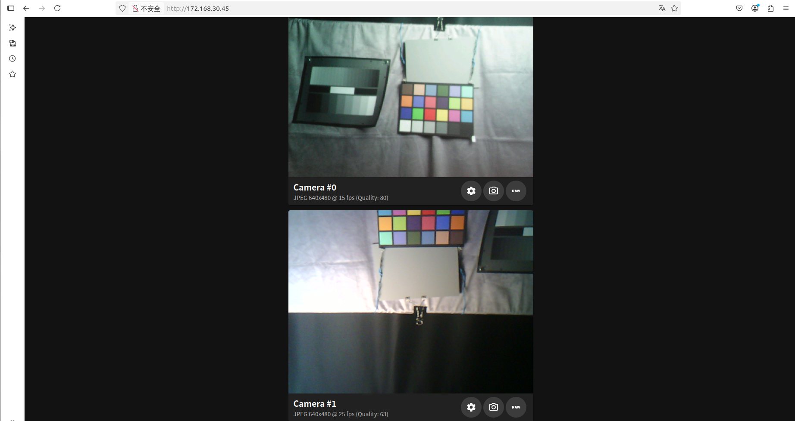

| 支持目标 | ESP32-P4 | ESP32-S3 | ESP32-C3 | ESP32-C6 | ESP32-C5 |
| -------- | -------- | -------- | -------- | -------- | -------- |

[English Version](./README.md)

# Simple Video Server 示例

*(更多示例信息请参见上一级 [examples](../) 目录中的 [README.md](../README.md) 文件。)*

## 概览

该示例演示如何在本地网络中用不同端口创建多个 HTTP 服务器。可以通过浏览器访问这些服务器，实现视频流、静态图像抓取、原始帧下载和摄像头设置更新。

固件会初始化所选 `esp_video` 摄像头设备，连接到已配置网络，在端口 80 启动主 Web UI，并从端口 81 开始为每个检测到的摄像头启动一个 MJPEG stream server。`frontend/gzipped` 下的 Web UI 资源会嵌入到固件镜像中。

## API Endpoints

示例提供以下 REST API endpoints：

| 端口 | Endpoint | 方法 | 描述 |
|:----:|:---------|:----:|:-----|
| 80 | `/` | GET | 提供用于浏览器视频显示的主 HTML 页面 |
| 80 | `/api/capture_image?source={n}` | GET | 返回指定摄像头传感器的 JPEG 图像。<br/>**参数**：`n` - 摄像头编号（0 = 第一个传感器，1 = 第二个传感器）<br/>**示例**：`/api/capture_image?source=0` |
| 80 | `/api/capture_binary?source={n}` | GET | 返回指定摄像头传感器的原始二进制图像数据。<br/>**参数**：`n` - 摄像头编号（0 = 第一个传感器，1 = 第二个传感器）<br/>**示例**：`/api/capture_binary?source=0` |
| 80 | `/api/get_camera_info` | GET | 获取所有摄像头传感器的信息，包括分辨率和 JPEG 压缩设置 |
| 80 | `/api/set_camera_config` | POST | 配置摄像头传感器设置，包括分辨率和 JPEG 压缩 |
| 81 | `/stream` | GET | 提供来自**第一个**摄像头传感器的连续 MJPEG 流 (*1) |
| 82 | `/stream` | GET | 提供来自**第二个**摄像头传感器的连续 MJPEG 流 (*1) |

> **Note (*1)**：服务器会持续把后台 JPEG 图像流式发送到客户端。从网页保存图像时，保存的图像可能不是实时的最新数据。

### 域名访问

默认情况下，示例启用 mDNS（Multicast DNS），因此可以用域名而不是 IP 地址访问服务器。例如：

- 图像抓取：`http://esp-web.local/api/capture_image?source=0`
- 主界面：`http://esp-web.local`

也可以直接使用设备 IP 地址访问所有 URL。

## 入门

### 硬件配置

使用此示例前，请参考 [video initialization configuration guide](components/example_video_common/README.md)，了解以下详细信息：

- 板级配置
- 摄像头传感器接口设置
- GPIO 引脚分配
- 时钟频率设置

ESP32-P4 默认配置选择 ESP32-P4-Function-EV-Board V1.5 profile，启用 MIPI-CSI，并选择 OV5647 MIPI RAW8 `800 x 1280` 传感器格式。使用其他开发板版本或摄像头模块时，请修改这些选项。

### 工程配置

打开工程配置菜单：

```bash
idf.py menuconfig
```

#### 网络连接设置

进入 **Example Connection Configuration**：

**Wi-Fi 接口配置：**

- **Wi-Fi SSID and Password**：ESP32 连接网络所需的 SSID 和密码。
- **SoftAP Settings**：如果希望 ESP32 作为接入点工作，请配置该项。

基础 `sdkconfig.defaults` 选择 Wi-Fi 连接模式。如果你的 ESP32-P4 配置依赖 remote Wi-Fi，请先配置 `esp_wifi_remote` 和 slave target，再期待 Web server 出现在网络上。

**Ethernet 接口配置：**

- **PHY Model**：在 `Ethernet PHY` 选项中选择你的 PHY 型号（例如 IP101）。
- **PHY Address**：根据开发板原理图设置 `PHY Address`。
- **Clock Configuration**：配置 EMAC Clock mode 和 SMI GPIO。

**Wi-Fi Remote 配置**（用于没有原生 Wi-Fi 支持的设备）：

默认使用 [esp_wifi_remote](https://github.com/espressif/esp-protocols/tree/master/components/esp_wifi_remote) 提供额外 Wi-Fi 接口能力。

在 `Wi-Fi Remote` 菜单中：

- 选择要连接到 MCU 的 slave target。

#### 摄像头传感器配置

进入 **Espressif Camera Sensors Configurations**：

- 选择要使用的摄像头传感器。
- 选择传感器目标输出格式。

#### 示例专用配置

1. **设置目标平台：**

   ```bash
   idf.py set-target esp32p4
   idf.py menuconfig
   ```

2. **配置视频 buffer 设置：**

   ```text
   Example Configuration  --->
       (2) Camera video buffer number
   ```

   > **建议**：更多 buffer 可以提升性能并减少丢帧，但会消耗更多内存。对于高分辨率传感器（例如 1080P），使用 2 个 buffer。

3. **设置 JPEG 压缩质量：**

   ```text
   Example Configuration  --->
       (80) JPEG compression quality (%)
   ```

   > **注意**：并非所有摄像头传感器都支持该设置。如果不支持，示例会自动选择最接近的受支持值。

4. **HTTP 和 mDNS 配置：**

   ```text
   Example Configuration  --->
       (123456789000000000000987654321) HTTP part boundary
       (web-cam) mDNS instance
       (esp-web) mDNS host name
   ```

   > **建议**：除非有明确需求，否则保持默认设置。

5. **摄像头传感器接口选择：**

   示例会初始化所有已启用的摄像头传感器，并把输出流式发送到客户端：

   ```text
   Example Video Initialization Configuration  --->
       Select and Set Camera Sensor Interface  --->
           [*] MIPI-CSI  ---
           [*] DVP  ---->
   ```

6. **共享 I2C 总线配置：**

   如果你的摄像头传感器共享同一组 I2C GPIO（例如 ESP32-P4-Function-EV-Board V1.5 上的 MIPI-CSI 和 DVP 传感器）：

   ```text
   Example Video Initialization Configuration  --->
       [*] Use Pre-initialized SCCB(I2C) Bus for All Camera Sensors And Motors
           (0) SCCB(I2C) Port Number
           (8) SCCB(I2C) SCL Pin
           (7) SCCB(I2C) SDA Pin
   ```

7. **选择目标摄像头传感器：**

   根据开发板选择传感器：

   ```text
   Component config  --->
       Espressif Camera Sensors Configurations  --->
           Camera Sensor Configuration  --->
               Select and Set Camera Sensor  --->
                   [ ] GC0308  ----
                   [*] GC2145  --->
                   [*] OV2640  ---->
   ```

8. **优化 DVP 接口性能：**

   为了让 DVP 接口摄像头传感器获得更好的帧率：

   ```text
   Component config  --->
       Espressif Camera Sensors Configurations  --->
           Camera Sensor Configuration  --->
               Select and Set Camera Sensor  --->
                   [*] OV2640  ---->
                       Select default output format for DVP interface (JPEG 640x480 25fps, DVP 8-bit, 20M input)  --->
                           ( ) YUV422 640x480 6fps, DVP 8-bit, 20M input
                           (X) JPEG 640x480 25fps, DVP 8-bit, 20M input
                           ( ) RGB565 240x240 25fps, DVP 8-bit, 20M input
   ```

9. **MIPI-CSI 裁剪支持：**

   如果启用 MIPI-CSI crop，请在 **Example Configuration** 中配置裁剪起点和尺寸。保持裁剪起点为偶数，并确保裁剪宽高不超过所选传感器输出帧。

## 构建和运行

1. **构建并烧录工程：**

   ```bash
   idf.py set-target esp32p4
   idf.py -p PORT flash monitor
   ```

   *（按 `Ctrl-]` 退出串口监视器）*

2. **完整设置说明**请参见 [ESP-IDF Getting Started Guide](https://docs.espressif.com/projects/esp-idf/en/latest/esp32p4/get-started/index.html)。

## 预期输出

运行该示例时，串口监视器应显示类似输出：

```text
...
I (1628) main_task: Started on CPU0
I (1638) esp_psram: Reserving pool of 32K of internal memory for DMA/internal allocations
I (1638) main_task: Calling app_main()
I (1648) mdns_mem: mDNS task will be created from internal RAM
I (1698) esp_eth.netif.netif_glue: 60:55:f9:fb:c2:3a
I (1698) esp_eth.netif.netif_glue: ethernet attached to netif
I (3298) ethernet_connect: Waiting for IP(s).
I (3298) ethernet_connect: Ethernet Link Up
I (4648) ethernet_connect: Got IPv6 event: Interface "example_netif_eth" address: fe80:0000:0000:0000:6255:f9ff:fefb:c23a, type: ESP_IP6_ADDR_IS_LINK_LOCAL
I (5298) esp_netif_handlers: example_netif_eth ip: 172.168.30.45, mask: 255.255.255.0, gw: 172.168.30.1
I (5298) ethernet_connect: Got IPv4 event: Interface "example_netif_eth" address: 172.168.30.45
I (5298) example_common: Connected to example_netif_eth
I (5308) example_common: - IPv4 address: 172.168.30.45,
I (5308) example_common: - IPv6 address: fe80:0000:0000:0000:6255:f9ff:fefb:c23a, type: ESP_IP6_ADDR_IS_LINK_LOCAL
I (5318) example_init_video: MIPI-CSI camera sensor I2C port=0, scl_pin=8, sda_pin=7, freq=100000
I (5328) example_init_video: DVP camera sensor I2C port=1, scl_pin=8, sda_pin=7, freq=100000
I (5378) ov2640: Detected Camera sensor PID=0x26
I (5378) gc2145: Detected Camera sensor PID=0x2145
I (5808) example: video0: width=640 height=480 format=RGBP
W (5908) example: JPEG compression quality=80 is out of sensor's range, reset to 63
I (5908) example: video1: width=640 height=480 format=JPEG
I (5908) example: Starting stream server on port: '80'
I (5918) example: Camera web server starts
I (5918) main_task: Returned from app_main()
...
```

## 访问 Web 界面

1. **打开浏览器**并访问以下地址之一：

   - `http://esp-web.local`（使用 mDNS）
   - `http://172.168.30.45`（替换为日志输出中的设备 IP 地址）

2. **Web 界面功能：**

   - 查看已连接摄像头的实时视频流。
   - **Camera Icon**：从所选视频流下载 JPEG 图像。
   - **Raw Icon**：从所选视频流下载原始二进制图像数据。
   - **Gear Icon**：配置所选视频流的图像参数。



## 排障

### 常见问题

**1. I2C Transaction Errors**

```text
E (1595) i2c.master: I2C transaction unexpected nack detected
E (1595) i2c.master: s_i2c_synchronous_transaction(870): I2C transaction failed
```

**解决方法：**

- 确认摄像头传感器已经正确连接到开发板。
- 检查 menuconfig 中配置的 I2C pins（SCL/SDA）是否正确。
- 确认开发板上存在 I2C 上拉电阻。
- 确认摄像头传感器供电稳定。
